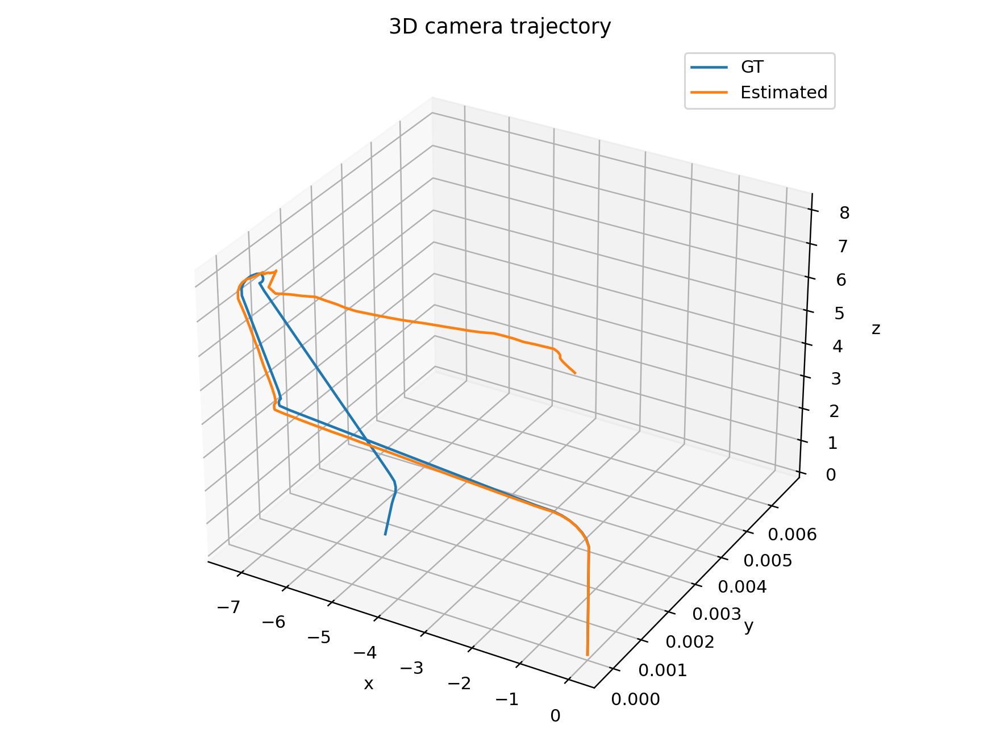
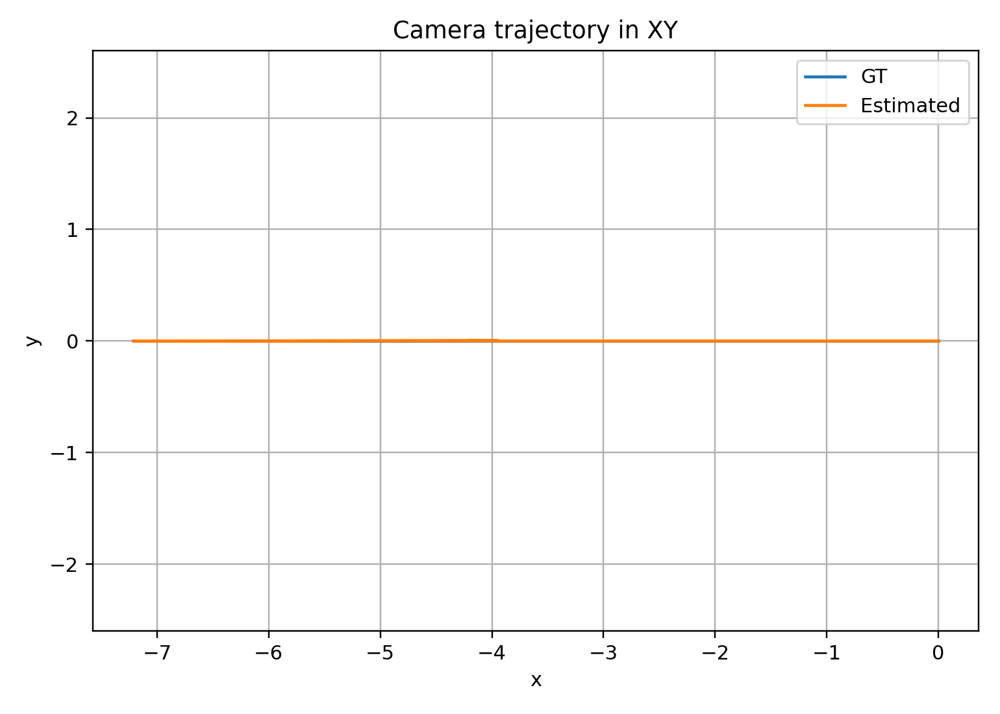
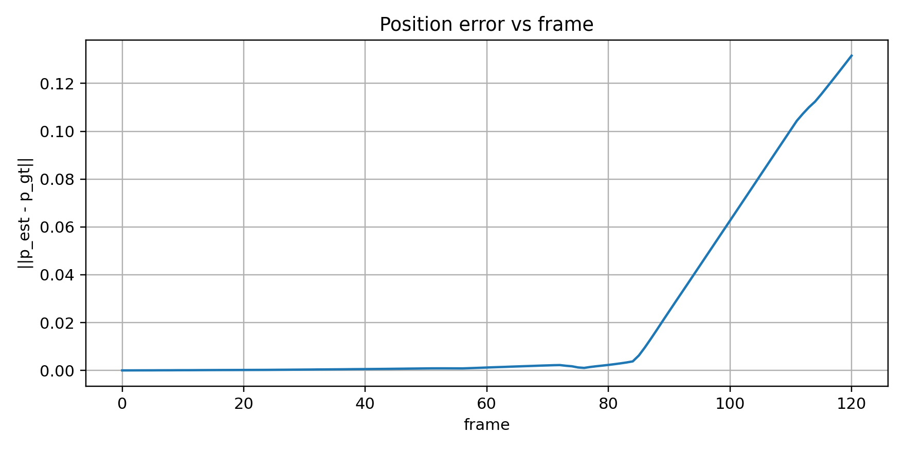
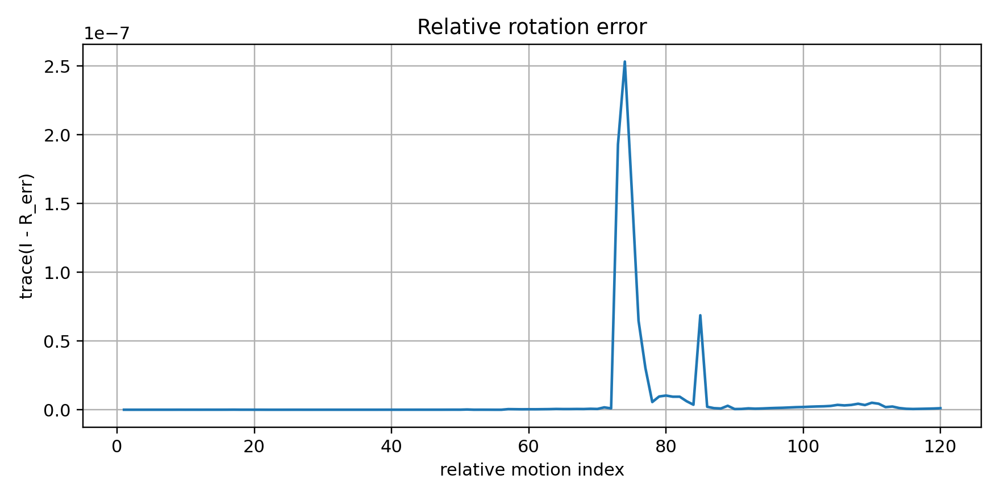
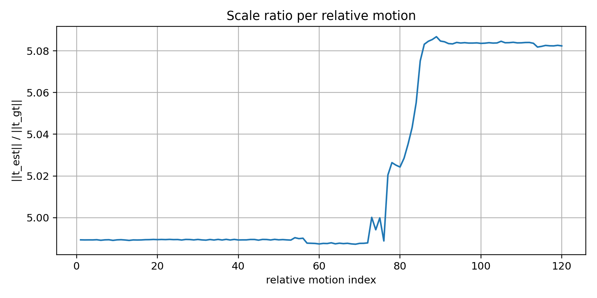
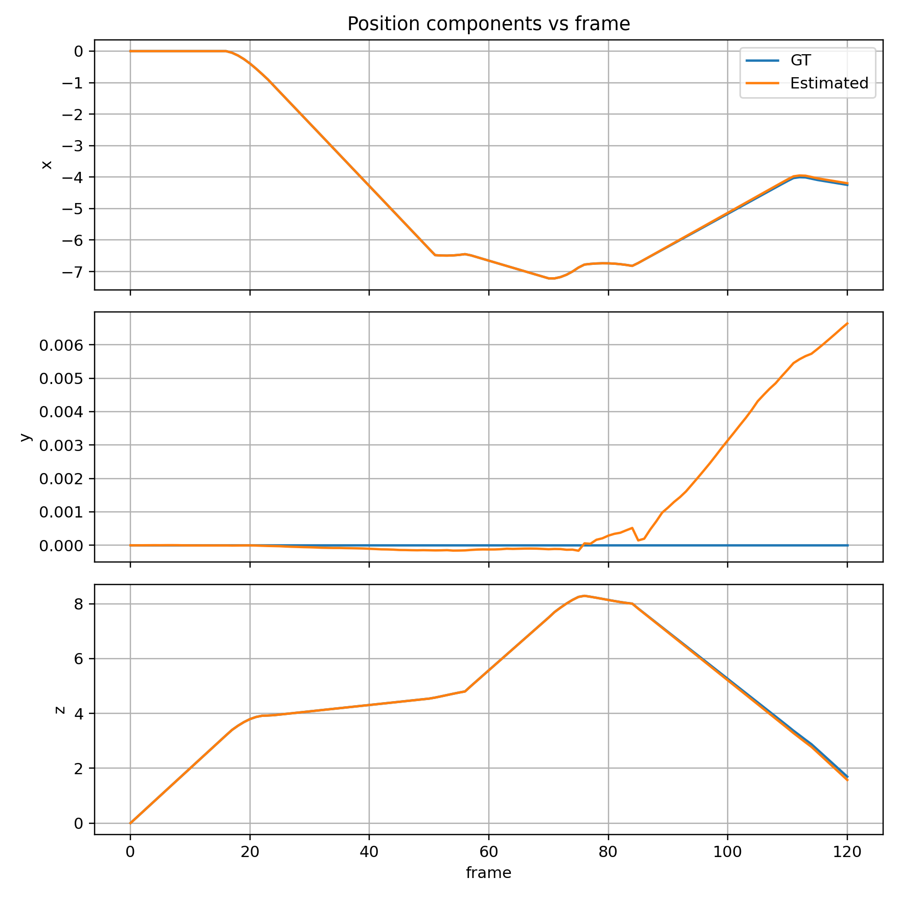
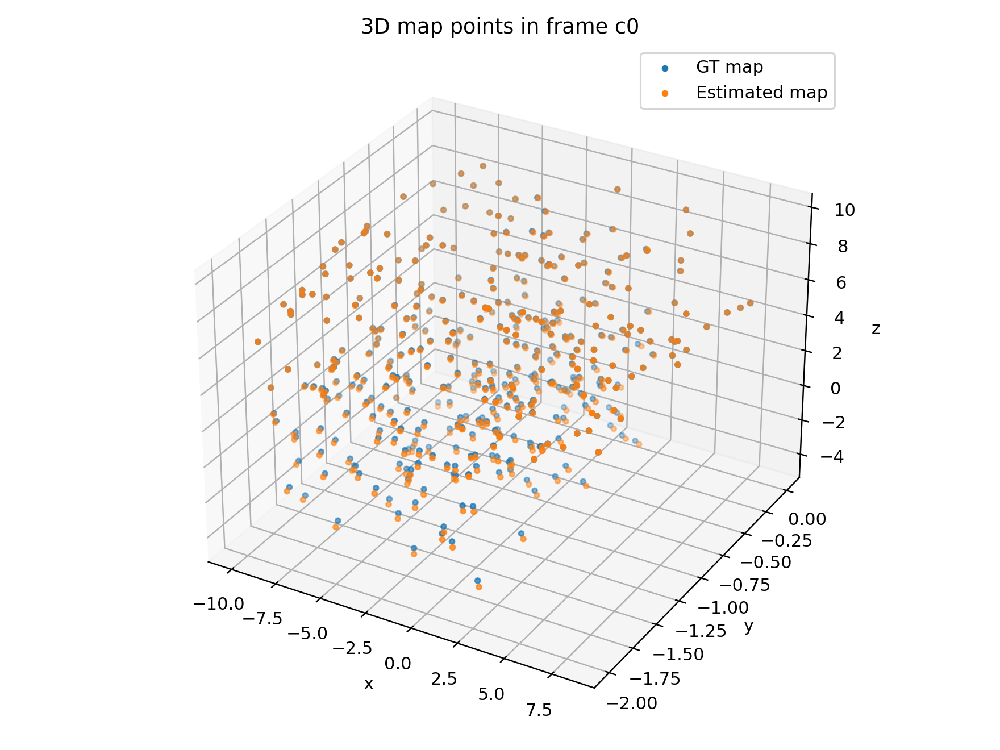
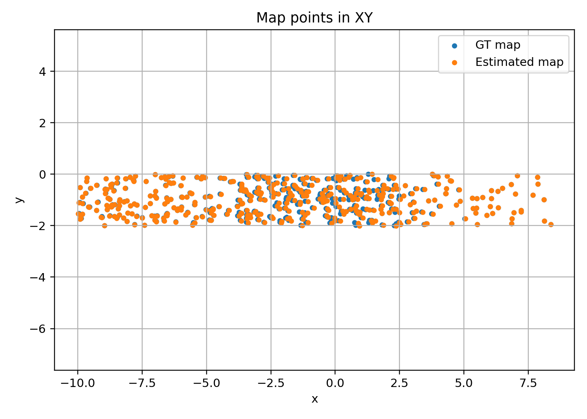
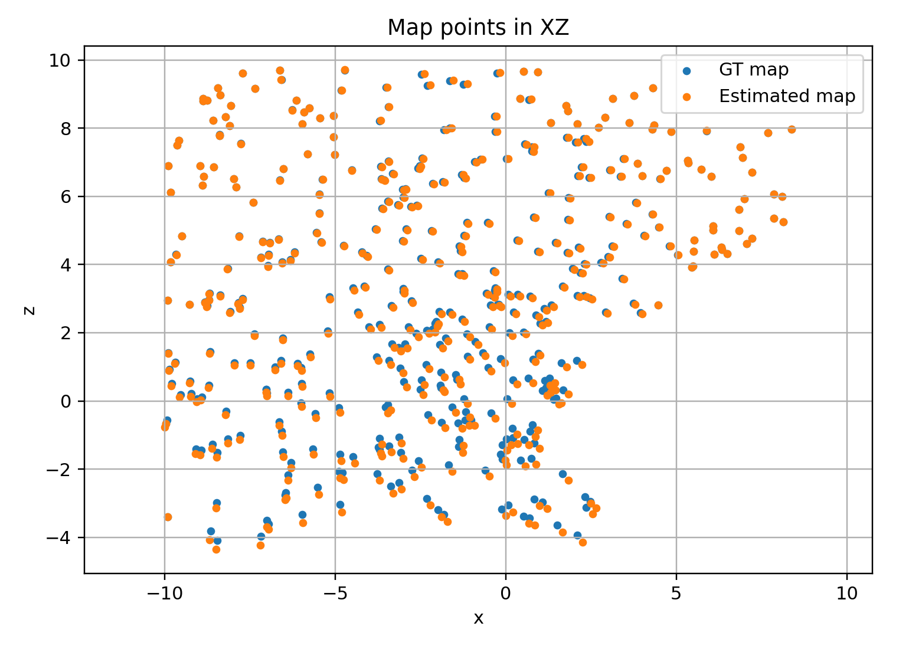

# Probabilistic Robotics — Visual Odometry

A complete visual odometry pipeline that estimates camera motion from image measurements and incrementally reconstructs a sparse 3D map of the observed scene.

Starting from the first two frames, the system initializes the relative pose, triangulates an initial point cloud, and then tracks the camera across the full sequence while progressively growing the map. The estimated trajectory and reconstruction are evaluated against ground truth.

---

## Goal

Estimate the 6-DoF motion of a camera in 3D using only visual observations: image feature measurements, camera calibration parameters, and appearance descriptors of observed landmarks.

The system is expected to initialize from a stereo pair, recover the full camera trajectory, triangulate a sparse map, and provide quantitative evaluation of both pose and reconstruction accuracy.

---

## Approach

The pipeline is built around four key ideas.

**Two-view initialization.**
The first two frames provide the initial correspondences used to estimate a relative pose and triangulate the first set of 3D landmarks.

**Active-cloud tracking.**
Rather than matching each new frame against the entire accumulated map, the system maintains a local set of recently triangulated points. This keeps the estimation stable and limits drift accumulation.

**Incremental map growth.**
New landmarks are triangulated from consecutive frames and merged into the global map as the camera advances through the sequence.

**Pose refinement.**
Each pose estimate is refined by minimizing reprojection error over the observed landmarks, with a robust initialization step to handle incorrect correspondences.

---

## Results

| Metric | Value |
|---|---|
| Valid relative pose pairs | 120 / 120 |
| Mean rotation trace error | 0.000000 |
| Median rotation trace error | 0.000000 |
| Mean scale ratio | 5.020486 |
| Median scale ratio | 4.989554 |
| Scale ratio std | 0.042870 |
| Scale correction | 0.200419 |
| RMSE position | **0.0439 m** |
| Matched map landmarks | 410 |
| Map RMSE | **0.1127 m** |

### Trajectory

| 3D trajectory | XY plane | Position error |
|---|---|---|
|  |  |  |

### Motion analysis

| Rotation error | Scale ratio | Components vs frame |
|---|---|---|
|  |  |  |

### Map reconstruction

| 3D scatter | XY projection | XZ projection |
|---|---|---|
|  |  |  |

---

## Interpretation

The strongest aspect of the system is the stability of motion estimation: rotation error is near zero, scale remains highly consistent across the entire sequence, and the final position RMSE is well below 5 cm. The reconstructed map aligns closely with ground truth after scale correction.

The switch to an active-cloud tracking strategy — using a local window of recent landmarks instead of the full map — was the single most impactful design decision, significantly improving robustness and accuracy.

---

## Limitations

This project is a sparse incremental visual odometry pipeline, not a full SLAM system. It does not include loop closure, bundle adjustment, global optimization, or dense reconstruction. Results should be interpreted in the context of an open-loop, incremental estimator.

---

## Repository Structure

```
.
├── data/                        # Input dataset
├── results/                     # Output trajectories, maps, and plots
├── src/                         # Source modules
├── main_vo_active.m             # Main VO pipeline
├── main_evaluate_vo.m           # Evaluation against ground truth
└── README.md
```

---

## How to Run

**Run the visual odometry pipeline**

```bash
octave-cli --silent main_vo_active.m
```

Produces `results/vo_active_results.mat`.

**Evaluate against ground truth**

```bash
octave-cli --silent main_evaluate_vo.m
```

Produces `results/evaluation_results.mat` and all result plots shown above.

---

## Development Path

The project was developed incrementally: dataset inspection → geometric verification → appearance-based matching → two-view initialization → triangulation → incremental tracking → pose refinement → robust initialization → active-cloud tracking → final evaluation. Each component was validated independently before integration.
