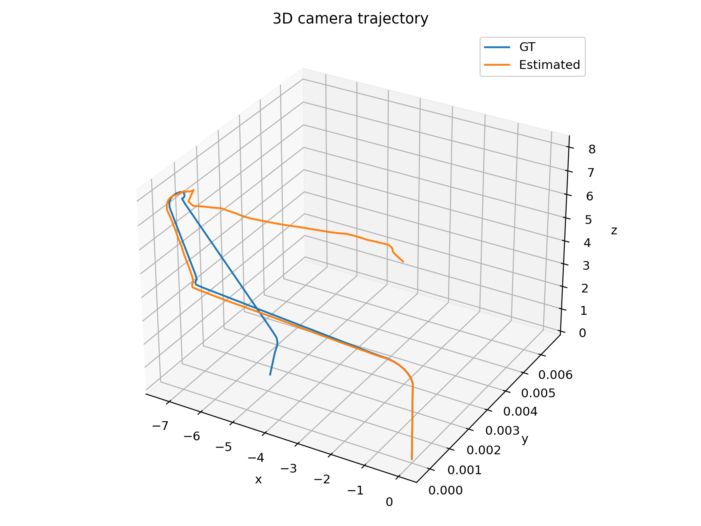
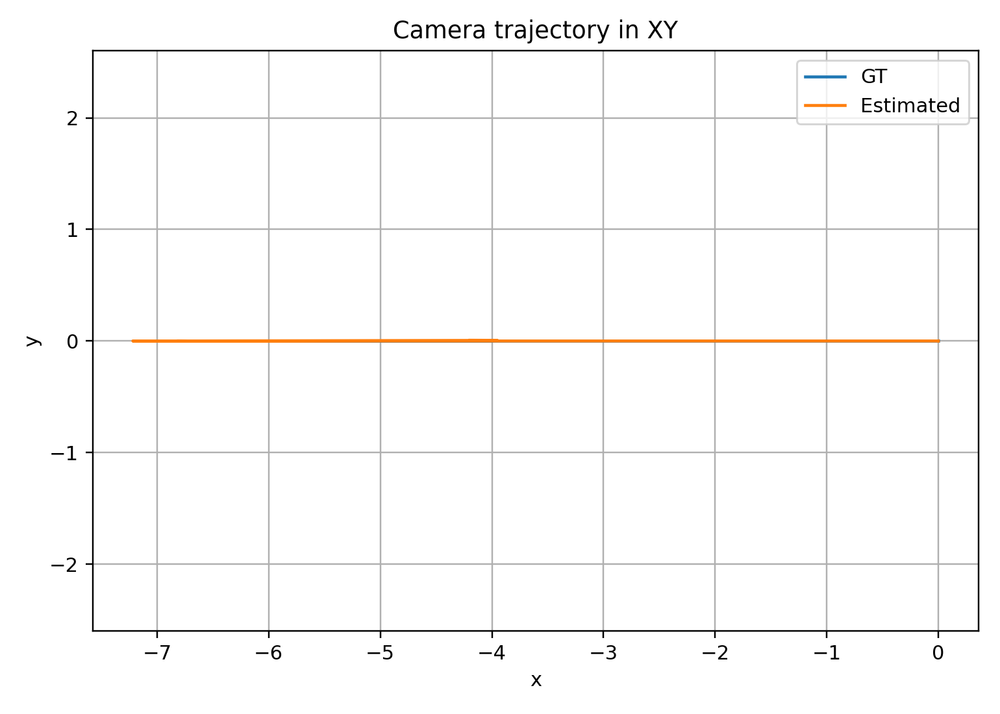
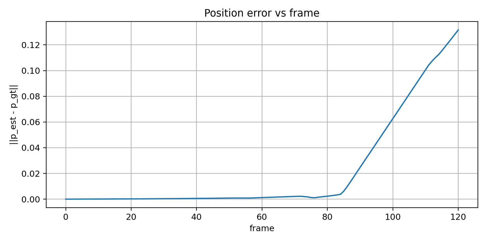
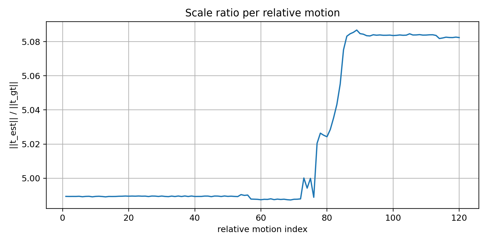
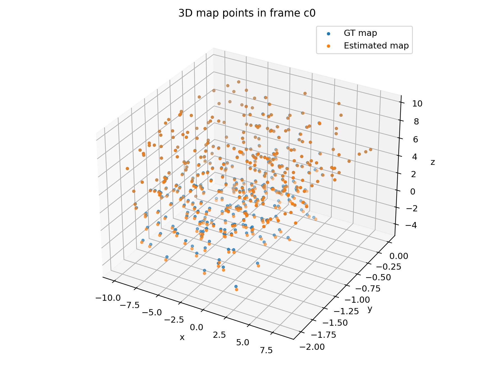
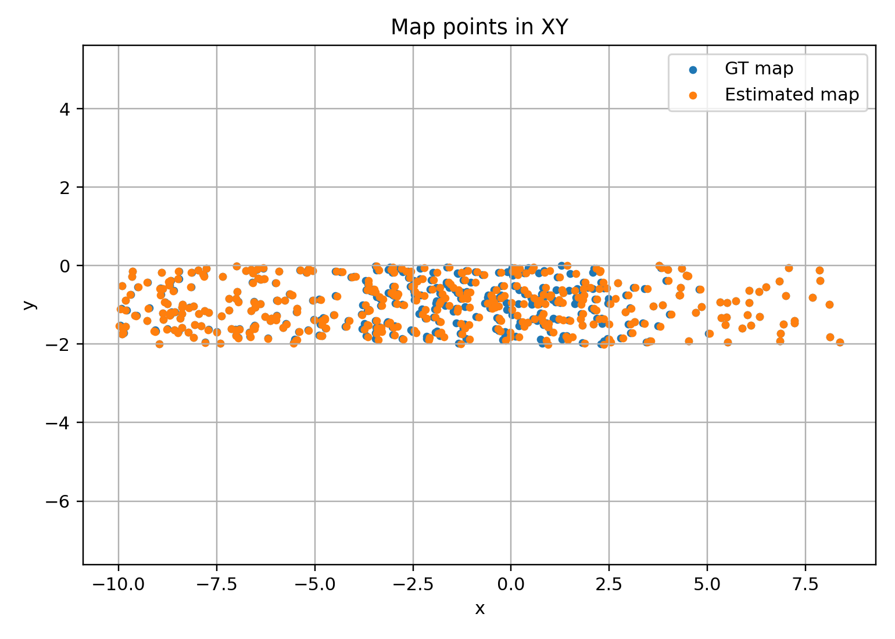

# Visual Odometry from Scratch — Active-Cloud Projective ICP


A **monocular visual odometry pipeline** implemented in GNU Octave that estimates camera motion and reconstructs a sparse 3D map from image measurements and appearance descriptors.

The project implements the main geometric estimation components explicitly: **Essential Matrix estimation, triangulation, RANSAC-based camera pose estimation, SE(3) pose refinement, reprojection-error minimization and incremental sparse mapping**.

The key design choice is an **active local 3D cloud**: instead of continuously tracking against the entire accumulated map, the odometry system estimates motion primarily from recently triangulated landmarks, using the global map only as a fallback.

---

## Results

| Metric                         |        Result |
| ------------------------------ | ------------: |
| Valid relative pose pairs      | **120 / 120** |
| Position RMSE                  |  **0.0439 m** |
| Mean rotation trace error      |       **≈ 0** |
| Median scale ratio             |    **4.9896** |
| Scale-ratio standard deviation |    **0.0429** |
| Matched map landmarks          |       **410** |
| Map RMSE                       |  **0.1127 m** |

The estimated monocular trajectory is recovered consistently up to the expected global scale ambiguity.

### Estimated vs Ground-Truth Trajectory

<p align="center">
  
  
</p>

### Position Error and Scale Consistency

<p align="center">
  
  
</p>

### Sparse 3D Reconstruction

<p align="center">
  
  
</p>

---

## Pipeline

```text
Image measurements
       │
       ▼
Appearance-based feature matching
       │
       ▼
Two-view initialization
  ├─ Essential Matrix
  ├─ E decomposition
  ├─ Cheirality test
  └─ Linear triangulation
       │
       ▼
Initial sparse 3D cloud
       │
       ▼
Frame-to-frame tracking
  ├─ Local active-cloud association
  ├─ 3D → 2D RANSAC + DLT
  └─ Global-map fallback
       │
       ▼
Projective ICP / SE(3) pose refinement
       │
       ▼
Triangulate new landmarks
       │
       ▼
Update active cloud + global sparse map
       │
       ▼
Estimated trajectory and 3D reconstruction
```

---

## Method

### 1. Two-View Initialization

The first two frames initialize the visual odometry system.

Feature correspondences are found using the provided appearance descriptors and converted from pixel coordinates to normalized camera coordinates.

The relative camera geometry is then estimated through the **8-point algorithm**:

1. build the epipolar constraint matrix;
2. solve for the Essential Matrix using SVD;
3. enforce the rank-2 Essential Matrix constraint;
4. decompose the matrix into candidate rotations and translations;
5. triangulate corresponding features;
6. select the physically valid pose through a **cheirality test**.

Because the system is monocular, the translation recovered during initialization is defined only up to scale.

---

### 2. Active-Cloud Tracking

A central design decision of this implementation is to avoid relying exclusively on the complete accumulated map for frame-to-frame pose estimation.

Instead, each new frame is primarily tracked against an **active cloud of recently triangulated landmarks**.

For every incoming frame:

1. features are matched between the previous and current image;
2. matches are propagated to their corresponding active 3D landmarks;
3. these provide 3D–2D correspondences for camera pose estimation.

This keeps the tracking problem local and reduces the effect of accumulated drift and stale associations.

---

### 3. Robust 3D–2D Pose Estimation

Camera pose is initialized using **RANSAC + Direct Linear Transform (DLT)**.

Each RANSAC iteration:

* samples six 3D–2D correspondences;
* computes a candidate camera pose through DLT;
* projects all candidate landmarks into the image;
* measures reprojection error;
* selects inliers using a pixel-error threshold.

The best model is finally re-estimated using all detected inliers.

If too few active-cloud correspondences are available, the system falls back to matching against the accumulated global map.

---

### 4. Projective ICP Pose Refinement

The RANSAC/DLT solution is refined by directly minimizing image reprojection error.

For every 3D landmark (P_i), the current pose predicts its image position

[
\hat{u}_i = \pi(KTP_i)
]

and the optimization minimizes

[
E(T)=\sum_i \rho\left(|\hat{u}_i-u_i|^2\right)
]

where (\rho) is a robust loss.

The optimizer uses:

* an **SE(3) pose update**;
* analytical projection Jacobians;
* **Huber weighting** for robust residual handling;
* damped normal equations;
* adaptive damping depending on whether a candidate update improves reprojection error.

This behaves as a projective ICP / robust nonlinear least-squares refinement step.

---

### 5. Incremental Triangulation

After estimating the motion between two consecutive frames, matched observations are triangulated to construct the next active cloud.

Candidate landmarks are retained only when:

* they have positive depth in both camera frames;
* their reprojection is geometrically valid;
* reprojection error stays below the configured threshold.

The resulting landmarks are transformed into the current camera frame and used for the following tracking iteration.

---

### 6. Sparse Global Map

Newly triangulated points are also transformed into the reference coordinate frame and inserted into a persistent sparse map.

The global map therefore serves two purposes:

* providing a complete reconstruction of the observed scene;
* acting as a fallback source of correspondences whenever the local active cloud becomes insufficient.

---

## Why an Active Cloud?

An earlier approach based primarily on matching the current frame against the full accumulated map produced significantly less stable tracking.

The final architecture therefore separates two concepts:

**Local map → motion estimation**

**Global map → persistent reconstruction and recovery**

The local active cloud contains landmarks triangulated from recent frame pairs and is continuously refreshed as the camera moves.

This architecture produced considerably more stable incremental tracking across the full sequence.

---

## Evaluation

Since monocular visual odometry cannot recover absolute translation scale directly, trajectory evaluation is based mainly on **relative camera motion**.

For two consecutive estimated poses:

[
T_{i,i+1}^{est}
]

the corresponding ground-truth relative transformation is computed and compared independently.

### Rotation

Rotation quality is measured using

[
e_R = \operatorname{trace}(I-R_{err})
]

where (R_{err}) represents the relative orientation discrepancy.

### Translation Scale

The relative translation scale is measured as

[
s_i =
\frac{|t_{est}|}
{|t_{gt}|}
]

A stable sequence of (s_i) indicates that the monocular reconstruction maintains a consistent global scale factor.

The median scale ratio is then used to align the estimated trajectory with the ground truth for absolute-position visualization.

### Map Evaluation

The reconstructed sparse map is scaled using the same estimated scale factor and compared with the available ground-truth landmarks.

---

## Project Structure

```text
.
├── data/
│   ├── camera.dat
│   ├── trajectory.dat
│   ├── world.dat
│   └── meas-XXXX.dat
│
├── src/
│   ├── assoc/             # appearance-based data association
│   ├── evaluation/        # trajectory and map metrics
│   ├── geometry/          # SE(3), transformations and geometry utilities
│   ├── init/              # Essential Matrix initialization
│   ├── io/                # dataset loaders
│   ├── map/               # global sparse-map management
│   ├── tracking/          # DLT, RANSAC and projective ICP
│   └── triangulation/     # linear triangulation and active cloud
│
├── results/               # evaluation outputs and figures
├── main_vo_active.m       # visual odometry pipeline
├── main_evaluate_vo.m     # quantitative evaluation
├── make_final_plots.py    # publication-quality plots
└── README.md
```

---

## Running the Project

### Requirements

The core visual odometry pipeline requires:

* **GNU Octave**

Optional Python visualization requires:

* Python 3
* NumPy
* SciPy
* Matplotlib

### Clone

```bash
git clone https://github.com/samuelecivale/probabilistic-robotics-visual-odometry.git
cd probabilistic-robotics-visual-odometry
```

### Run Visual Odometry

```bash
octave-cli --silent main_vo_active.m
```

The estimated poses and sparse map are saved to:

```text
results/vo_active_results.mat
```

### Evaluate

```bash
octave-cli --silent main_evaluate_vo.m
```

This evaluates the estimated trajectory and sparse map against the available ground truth.

### Generate Figures

```bash
python make_final_plots.py
```

---

## Dataset

The provided dataset contains calibrated image measurements rather than raw images.

### `camera.dat`

Camera calibration information including the intrinsic matrix and image geometry.

### `meas-XXXX.dat`

Per-frame visual measurements containing:

* feature identifier;
* image coordinates;
* 10-dimensional appearance descriptor.

### `trajectory.dat`

Ground-truth camera trajectory used **only for evaluation**.

### `world.dat`

Ground-truth 3D landmarks used **only for reconstruction evaluation**.

Ground truth is therefore not used by the visual odometry estimator itself.

---

## What This Project Demonstrates

This project covers several core concepts in robotics perception and state estimation:

* Monocular Visual Odometry
* Multi-View Geometry
* Essential Matrix Estimation
* Epipolar Geometry
* Linear Triangulation
* Perspective Camera Models
* 3D–2D Pose Estimation
* RANSAC
* Direct Linear Transform
* SE(3) Transformations
* Robust Nonlinear Least Squares
* Projective ICP
* Reprojection-Error Minimization
* Sparse 3D Mapping
* Data Association
* Trajectory Evaluation
* Monocular Scale Ambiguity

---

## Key Takeaway

The main result of the project is not only the final trajectory accuracy, but the effect of the **mapping strategy on estimator stability**.

Using recently triangulated landmarks as a local active map while retaining the complete sparse map as a recovery mechanism produced a robust pipeline capable of estimating all **120 relative camera motions** in the test sequence while maintaining consistent monocular scale and centimeter-level trajectory accuracy after scale alignment.
